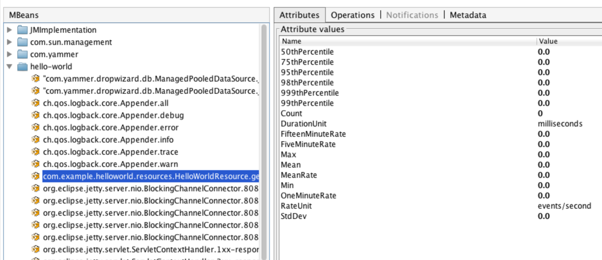

.. _getting-started:

###############
Getting Started
###############

.. highlight:: text

.. rubric:: *Getting Started* will guide you through the process of adding Metrics to an existing
            application. We'll go through the various measuring instruments that Metrics provides,
            how to use them, and when they'll come in handy.

.. _gs-maven:

Setting Up Maven
================

You need the ``metrics-core`` library as a dependency:

.. code-block:: xml

    <dependencies>
        <dependency>
            <groupId>io.dropwizard.metrics</groupId>
            <artifactId>metrics-core</artifactId>
            <version>${metrics.version}</version>
        </dependency>
    </dependencies>

.. note::

    Make sure you have a ``metrics.version`` property declared in your POM with the current version,
    which is |release|.

Now it's time to add some metrics to your application!

.. _gs-meters:

Meters
======

A meter measures the rate of events over time (e.g., "requests per second"). In addition to the mean
rate, meters also track 1-, 5-, and 15-minute moving averages.

.. code-block:: java

    private final MetricRegistry metrics = new MetricRegistry();
    private final Meter requests = metrics.meter("requests");

    public void handleRequest(Request request, Response response) {
        requests.mark();
        // etc
    }

This meter will measure the rate of requests in requests per second.

.. _gs-reporter:

Console Reporter
================

A Console Reporter is exactly what it sounds like - report to the console.
This reporter will print every second.

.. code-block:: java

     ConsoleReporter reporter = ConsoleReporter.forRegistry(metrics)
            .convertRatesTo(TimeUnit.SECONDS)
            .convertDurationsTo(TimeUnit.MILLISECONDS)
            .build();
        reporter.start(1, TimeUnit.SECONDS);

.. _gs-complete:

Complete getting started
========================

So the complete Getting Started is

.. code-block:: java
    
    package sample;
    import io.dropwizard.metrics5.*;
    import java.util.concurrent.TimeUnit;

    public class GetStarted {
      static final MetricRegistry metrics = new MetricRegistry();
      public static void main(String args[]) {
        startReport();
        Meter requests = metrics.meter("requests");
        requests.mark();
        wait5Seconds();
      }

    static void startReport() {
        ConsoleReporter reporter = ConsoleReporter.forRegistry(metrics)
            .convertRatesTo(TimeUnit.SECONDS)
            .convertDurationsTo(TimeUnit.MILLISECONDS)
            .build();
        reporter.start(1, TimeUnit.SECONDS);
    }

    static void wait5Seconds() {
        try {
            Thread.sleep(5*1000);
        }
        catch(InterruptedException e) {}
    }
  }

.. code-block:: xml

  <?xml version="1.0" encoding="UTF-8"?>
  <project xmlns="http://maven.apache.org/POM/4.0.0" xmlns:xsi="http://www.w3.org/2001/XMLSchema-instance" xsi:schemaLocation="http://maven.apache.org/POM/4.0.0 http://maven.apache.org/xsd/maven-4.0.0.xsd">
    <modelVersion>4.0.0</modelVersion>

    <groupId>somegroup</groupId>
    <artifactId>sample</artifactId>
    <version>0.0.1-SNAPSHOT</version>
    <name>Example project for Metrics</name>

    <dependencies>
      <dependency>
        <groupId>io.dropwizard.metrics</groupId>
        <artifactId>metrics-core</artifactId>
        <version>${metrics.version}</version>
      </dependency>
    </dependencies>
  </project>

.. note::

    Make sure you have a ``metrics.version`` property declared in your POM with the current version,
    which is |release|.

To run

.. code-block:: sh

  mvn package exec:java -Dexec.mainClass=sample.GetStarted

.. _gs-registry:

The Registry
============

The centerpiece of Metrics is the ``MetricRegistry`` class, which is the container for all your
application's metrics. Go ahead and create a new one:

.. code-block:: java

    final MetricRegistry metrics = new MetricRegistry();

You'll probably want to integrate this into your application's lifecycle (maybe using your
dependency injection framework), but ``static`` field is fine.

.. _gs-gauges:

Gauges
======

A gauge is an instantaneous measurement of a value. For example, we may want to measure the number
of pending jobs in a queue:

.. code-block:: java

    public class QueueManager {
        private final Queue queue;

        public QueueManager(MetricRegistry metrics, String name) {
            this.queue = new Queue();
            metrics.register(MetricRegistry.name(QueueManager.class, name, "size"),
                             new Gauge<Integer>() {
                                 @Override
                                 public Integer getValue() {
                                     return queue.size();
                                 }
                             });
        }
    }

When this gauge is measured, it will return the number of jobs in the queue.

Every metric in a registry has a unique name, which is just a dotted-name string like
``"things.count"`` or ``"com.example.Thing.latency"``. ``MetricRegistry`` has a static helper method
for constructing these names:

.. code-block:: java

    MetricRegistry.name(QueueManager.class, "jobs", "size")

This will return a string with something like ``"com.example.QueueManager.jobs.size"``.

For most queue and queue-like structures, you won't want to simply return ``queue.size()``. Most of
``java.util`` and ``java.util.concurrent`` have implementations of ``#size()`` which are **O(n)**,
which means your gauge will be slow (potentially while holding a lock).

.. _gs-counters:

Counters
========

A counter is just a gauge for an ``AtomicLong`` instance. You can increment or decrement its value.
For example, we may want a more efficient way of measuring the pending job in a queue:

.. code-block:: java

    private final Counter pendingJobs = metrics.counter(name(QueueManager.class, "pending-jobs"));

    public void addJob(Job job) {
        pendingJobs.inc();
        queue.offer(job);
    }

    public Job takeJob() {
        pendingJobs.dec();
        return queue.take();
    }

Every time this counter is measured, it will return the number of jobs in the queue.

As you can see, the API for counters is slightly different: ``#counter(String)`` instead of
``#register(String, Metric)``. While you can use ``register`` and create your own ``Counter``
instance, ``#counter(String)`` does all the work for you, and allows you to reuse metrics with the
same name.

Also, we've statically imported ``MetricRegistry``'s ``name`` method in this scope to reduce
clutter.

.. _gs-histograms:

Histograms
==========

A histogram measures the statistical distribution of values in a stream of data. In addition to
minimum, maximum, mean, etc., it also measures median, 75th, 90th, 95th, 98th, 99th, and 99.9th
percentiles.

.. code-block:: java

    private final Histogram responseSizes = metrics.histogram(name(RequestHandler.class, "response-sizes"));

    public void handleRequest(Request request, Response response) {
        // etc
        responseSizes.update(response.getContent().length);
    }

This histogram will measure the size of responses in bytes.

.. _gs-timers:

Timers
======

A timer measures both the rate that a particular piece of code is called and the distribution of its
duration.

.. code-block:: java

    private final Timer responses = metrics.timer(name(RequestHandler.class, "responses"));

    public String handleRequest(Request request, Response response) {
        final Timer.Context context = responses.time();
        try {
            // etc;
            return "OK";
        } finally {
            context.stop();
        }
    }

This timer will measure the amount of time it takes to process each request in nanoseconds and
provide a rate of requests in requests per second.

.. _gs-healthchecks:

Health Checks
=============

Metrics also has the ability to centralize your service's health checks with the
``metrics-healthchecks`` module.

First, create a new ``HealthCheckRegistry`` instance:

.. code-block:: java

    final HealthCheckRegistry healthChecks = new HealthCheckRegistry();

Second, implement a ``HealthCheck`` subclass:

.. code-block:: java

    public class DatabaseHealthCheck extends HealthCheck {
        private final Database database;

        public DatabaseHealthCheck(Database database) {
            this.database = database;
        }

        @Override
        public HealthCheck.Result check() throws Exception {
            if (database.isConnected()) {
                return HealthCheck.Result.healthy();
            } else {
                return HealthCheck.Result.unhealthy("Cannot connect to " + database.getUrl());
            }
        }
    }

Then register an instance of it with Metrics:

.. code-block:: java

    healthChecks.register("postgres", new DatabaseHealthCheck(database));

To run all of the registered health checks:

.. code-block:: java

    final Map<String, HealthCheck.Result> results = healthChecks.runHealthChecks();
    for (Entry<String, HealthCheck.Result> entry : results.entrySet()) {
        if (entry.getValue().isHealthy()) {
            System.out.println(entry.getKey() + " is healthy");
        } else {
            System.err.println(entry.getKey() + " is UNHEALTHY: " + entry.getValue().getMessage());
            final Throwable e = entry.getValue().getError();
            if (e != null) {
                e.printStackTrace();
            }
        }
    }

Metrics comes with a pre-built health check: ``ThreadDeadlockHealthCheck``, which uses Java's
built-in thread deadlock detection to determine if any threads are deadlocked.

.. _gs-jmx:

Reporting Via JMX
=================

To report metrics via JMX, include the ``metrics-jmx`` module as a dependency:

.. code-block:: xml

    <dependency>
        <groupId>io.dropwizard.metrics</groupId>
        <artifactId>metrics-jmx</artifactId>
        <version>${metrics.version}</version>
    </dependency>

.. note::

    Make sure you have a ``metrics.version`` property declared in your POM with the current version,
    which is |release|.

.. code-block:: java

    final JmxReporter reporter = JmxReporter.forRegistry(registry).build();
    reporter.start();

Once the reporter is started, all of the metrics in the registry will become visible via
**JConsole** or **VisualVM** (if you install the MBeans plugin):

.. tip::

    If you double-click any of the metric properties, VisualVM will start graphing the data for that
    property. Sweet, eh?

.. _gs-http:

Reporting Via HTTP
==================

Metrics also ships with a servlet (``AdminServlet``) which will serve a JSON representation of all
registered metrics. It will also run health checks, print out a thread dump, and provide a simple
"ping" response for load-balancers. (It also has single servlets--``MetricsServlet``,
``HealthCheckServlet``, ``ThreadDumpServlet``, and ``PingServlet``--which do these individual
tasks.)

To use this servlet, include the ``metrics-servlets`` module as a dependency:

.. code-block:: xml

    <dependency>
        <groupId>io.dropwizard.metrics</groupId>
        <artifactId>metrics-servlets</artifactId>
        <version>${metrics.version}</version>
    </dependency>

.. note::

    Make sure you have a ``metrics.version`` property declared in your POM with the current version,
    which is |release|.

From there on, you can map the servlet to whatever path you see fit.

.. _gs-other:

Other Reporting
===============

In addition to JMX and HTTP, Metrics also has reporters for the following outputs:

* ``STDOUT``, using :ref:`ConsoleReporter <man-core-reporters-console>` from ``metrics-core``
* ``CSV`` files, using :ref:`CsvReporter <man-core-reporters-csv>` from ``metrics-core``
* SLF4J loggers, using :ref:`Slf4jReporter <man-core-reporters-slf4j>` from ``metrics-core``
* Graphite, using :ref:`GraphiteReporter <manual-graphite>` from ``metrics-graphite``
